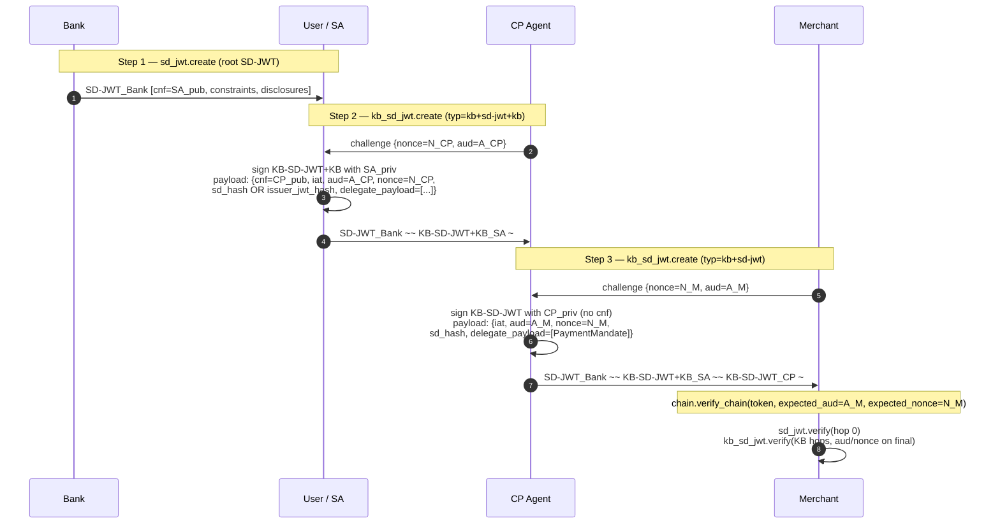

# AP2 Python SDK

Runtime do Agent Payments Protocol: emissão, apresentação e verificação
de mandates (autorizações assinadas) e receipts (comprovantes). Baseado em
SD-JWT / KB-JWT, com cadeias de delegação dSD-JWT de profundidade arbitrária.

## Organização dos arquivos

A implementação de SD-JWT fica em `sdjwt/`; a fachada do AP2 a conecta à
criação, apresentação e verificação de mandates:

- `sdjwt/sd_jwt.py` — SD-JWT raiz, assinado pelo emissor (RFC 9901 §4).
  Contém `create` e `verify` do token raiz; os helpers de hash são
  exportados por `ap2.sdk.sdjwt`.
- `sdjwt/kb_sd_jwt.py` — hops (saltos da cadeia) KB-SD-JWT (draft §5.1.4).
  Hops intermediários usam `typ=kb+sd-jwt+kb` e exigem `cnf`; hops
  terminais usam `typ=kb+sd-jwt` e não podem conter `cnf`.
- `sdjwt/chain.py` — `verify_chain`: percorre a cadeia unida por `~~`,
  segue o `cnf` e encaminha cada hop para a primitiva correta.
- `sdjwt/common.py` — parsing, hashing e helpers de SD-JWT compartilhados.
- `mandate.py` — fachada `MandateClient` (`create` / `present` /
  `verify`) + wrapper tipado `SdJwtMandate[T]`.
- `receipt_wrapper.py` — `ReceiptClient` (cria / verifica receipts).
- `disclosure_metadata.py` — regras de divulgação seletiva.
- `constraints.py`, `payment_mandate_chain.py`,
  `checkout_mandate_chain.py` — wrappers tipados de cadeia e
  verificação de constraints.
- `jwt_helper.py` — JWTs ES256 simples (usados para assinar receipts).
- `utils.py` — `compute_sha256_b64url` etc.
- `generated/` — modelos Pydantic gerados a partir dos JSON schemas.

### Onde cada primitiva entra no fluxo



### Ocultar disclosures do próximo delegado

Cada hop KB-SD-JWT se vincula ao token anterior com
`sd_hash` (cobre o JWT anterior *e* as disclosures) ou
`issuer_jwt_hash` (cobre só o JWT anterior, então as disclosures
podem mudar). O modo é escolhido em
`MandateClient.present(..., hash_mode="sd_hash" | "issuer_jwt_hash")`.

- `"sd_hash"` (padrão): fixa exatamente as disclosures que o hop atual
  repassa. O próximo delegado não pode removê-las.
- `"issuer_jwt_hash"`: permite que o próximo delegado descarte disclosures
  do SD-JWT anterior sem quebrar a integridade da cadeia. Use quando o
  hop atual quiser permitir minimização de dados nos hops seguintes.

### Diferenças em relação a draft-gco-oauth-delegate-sd-jwt-00

- **Sem o formato dSD-JWT+KB.** O AP2 sempre termina com um KB-SD-JWT
  `typ=kb+sd-jwt` cujo payload contém `aud`/`nonce`/`sd_hash`, conforme
  a spec (um KB-SD-JWT É um KB-JWT).
  O formato alternativo com `+KB` externo e um KB-JWT simples separado
  no final não é emitido nem aceito.

## API pública

### `MandateClient`

| Método | O que faz |
| --- | --- |
| `create(payloads, issuer_key, sd=None)` | Assina um SD-JWT raiz via `sd_jwt.create`. Com `sd=None`, a divulgação seletiva é derivada automaticamente das anotações `x-selectively-disclosable-*` do modelo do payload. |
| `present(holder_key, mandate_token, payloads, claims_to_disclose=None, nonce=None, aud=None, hash_mode="sd_hash")` | Acrescenta um hop de delegação sobre `mandate_token` via `kb_sd_jwt.create`. Open mandates com `cnf` criam hops intermediários; closed mandates criam hops terminais. Passe `hash_mode="issuer_jwt_hash"` para permitir que o próximo delegado remova disclosures do SD-JWT anterior. Chame de novo sobre o resultado para mais hops. |
| `verify(token, key_or_provider, payload_type=None, expected_aud=None, expected_nonce=None, ...)` | Verificador unificado via `chain.verify_chain`. `token` pode ser um SD-JWT único ou uma cadeia unida por `~~` de qualquer profundidade. Retorna `SdJwtMandate[T]` para token único e `list[dict]` com os payloads efetivos de cada token para cadeias. |
| `get_closed_mandate_jwt(token)` | O JWT folha da cadeia (último segmento `~~`, antes de qualquer `~`). Seu `sha256` é a `reference` canônica do receipt — estável independentemente da profundidade e das disclosures escolhidas. |

`claims_to_disclose` em `present()`: `None` → revela tudo, `{}` → não
revela nada, dict → revela os campos indicados.

### `ReceiptClient`

| Método | O que faz |
| --- | --- |
| `create_payment_receipt(payment_mandate_content, reference)` | Monta um modelo `PaymentReceipt`. A assinatura é feita à parte com `create_jwt`. |
| `create_checkout_receipt(merchant, reference, order_id)` | Monta um modelo `CheckoutReceipt`. A assinatura é feita à parte com `create_jwt`. |
| `verify_receipt(receipt_jwt, receipt_issuer_public_key, has_reference_in_store_cb=None, is_payment_receipt=True)` | Verifica a assinatura ES256 e, se o callback for informado, se `reference` aponta para um closed mandate conhecido. |

Reference canônica do receipt:

```python
reference = compute_sha256_b64url(
    MandateClient().get_closed_mandate_jwt(chain)
)
```

## Modelos de dados (`generated/`)

| Modelo | `vct` | Papel |
| --- | --- | --- |
| `OpenPaymentMandate` | `mandate.payment.open` | Open payment mandate + constraints |
| `OpenCheckoutMandate` | `mandate.checkout.open` | Open checkout mandate + regras de itens |
| `PaymentMandate` | `mandate.payment` | Closed payment mandate |
| `CheckoutMandate` | `mandate.checkout` | Closed checkout mandate |
| `PaymentReceipt` / `CheckoutReceipt` | — | Payloads de receipt (sucesso/erro discriminados) |
| `Amount`, `Merchant`, `PaymentInstrument`, … | — | Tipos compartilhados em `ap2.sdk.generated.types` |

Anotações de divulgação seletiva nos modelos:

| Campo | Modelo | Anotação |
| --- | --- | --- |
| `checkout_jwt` | `CheckoutMandate` | `x-selectively-disclosable-field` |
| `allowed` | `AllowedPayees` | `x-selectively-disclosable-array` |
| `allowed` | `AllowedPaymentInstruments` | `x-selectively-disclosable-array` |
| `allowed_merchants` | `AllowedMerchants` | `x-selectively-disclosable-array` |
| `acceptable_items` | `LineItemRequirements` | `x-selectively-disclosable-array` |

## Formato de transmissão

Uma cadeia dSD-JWT tem profundidade arbitrária. Os hops são unidos por `~~`:

```
<root_SD-JWT>~<disc…>~~<KB-SD-JWT+KB_1>~<disc…>~~…~~<closed_KB-SD-JWT>~<disc…>~
```

- **SD-JWT raiz** — emitido pela raiz de confiança (no AP2, normalmente o
  banco / provedor do agente). Contém `cnf` para que o próximo hop possa
  assinar por cima.
- **KB-SD-JWT+KBs intermediários** (`typ=kb+sd-jwt+kb`) — cada um assinado
  pelo `cnf.jwk` do hop anterior e com seu próprio `cnf`. Pode haver
  qualquer quantidade (zero ou mais). Vincula-se ao hop anterior via
  `sd_hash` ou `issuer_jwt_hash` e contém `iat`, `aud`, `nonce`.
- **Closed mandate (folha)** (`typ=kb+sd-jwt`) — KB-SD-JWT final com um
  payload `PaymentMandate` ou `CheckoutMandate` e sem `cnf` de saída.
  Vincula-se ao hop anterior via `sd_hash` ou `issuer_jwt_hash` e contém
  `iat` e, opcionalmente, `aud`/`nonce`.

Um KB-SD-JWT *é* um KB-JWT (draft §5.1.4), então as claims de
vinculação/transação ficam no seu payload — o AP2 não emite a variante
dSD-JWT+KB com um KB-JWT simples separado no final.

`typ` do header: `kb+sd-jwt+kb` quando o payload contém `cnf` (aberto,
nova delegação possível), `kb+sd-jwt` caso contrário (fechado, terminal).

## Cadeia de confiança

```
Root issuer
    │ signs
    ▼
┌────────────────────────────┐
│ Root SD-JWT                │
│ constraints, cnf = Del_1   │──┐
└────────────────────────────┘  │ cnf delegates
                                ▼
                        ┌───────────────────────────────┐
            Del_1 signs │ KB-SD-JWT (open)              │
                        │ sd_hash, cnf = Del_2          │──┐  (repeat for any
                        └───────────────────────────────┘  │   number of hops)
                                                           ▼
                                                 ┌─────────────────────────────┐
                                     Final       │ Closed KB-SD-JWT            │
                                     delegate    │ typ=kb+sd-jwt               │
                                     signs ────▶ │ sd_hash, aud, nonce, iat    │
                                                 │ delegate_payload = {        │
                                                 │   vct: mandate.payment, …   │
                                                 │ }                           │
                                                 └─────────────────────────────┘
```

O verificador confia apenas na chave do emissor raiz. Cada hop é validado
pelo `cnf.jwk` do hop anterior; o `sd_hash` do closed mandate se vincula a
toda a cadeia anterior; a `reference = sha256(closed leaf JWT)` do receipt
vincula o receipt pós-liquidação ao mandate autorizado.

## Exemplo

```python
import json, time
from cryptography.hazmat.primitives.asymmetric import ec
from jwcrypto.jwk import JWK

from ap2.sdk.mandate import MandateClient
from ap2.sdk.payment_mandate_chain import PaymentMandateChain
from ap2.sdk.utils import compute_sha256_b64url
from ap2.sdk.generated.open_payment_mandate import (
    AllowedPayees, AmountRange, OpenPaymentMandate,
)
from ap2.sdk.generated.payment_mandate import PaymentMandate
from ap2.sdk.generated.types.amount import Amount
from ap2.sdk.generated.types.merchant import Merchant
from ap2.sdk.generated.types.payment_instrument import PaymentInstrument


def jwk_with_kid(raw_key, kid):
    d = json.loads(JWK.from_pyca(raw_key).export())
    d["kid"] = kid
    return JWK(**d)


issuer_jwk = jwk_with_kid(ec.generate_private_key(ec.SECP256R1()), "issuer-1")
agent_jwk  = jwk_with_kid(ec.generate_private_key(ec.SECP256R1()), "agent-1")
agent_pub  = json.loads(agent_jwk.export_public())
client     = MandateClient()
now        = int(time.time())

# 1. Issue the open (root) mandate.
open_token = client.create(
    payloads=[OpenPaymentMandate(
        constraints=[
            AmountRange(currency="USD", min=0, max=5000),
            AllowedPayees(allowed=[Merchant(id="M-1", name="Cat Store")]),
        ],
        cnf={"jwk": agent_pub},
        iat=now, exp=now + 3600,
    )],
    issuer_key=issuer_jwk,
)

# 2. Agent creates the closed mandate on top (one delegation hop).
chain = client.present(
    holder_key=agent_jwk,
    mandate_token=open_token,
    payloads=[PaymentMandate(
        transaction_id="tx_abc",
        payee=Merchant(id="M-1", name="Cat Store"),
        payment_amount=Amount(amount=2500, currency="USD"),
        payment_instrument=PaymentInstrument(type="card", id="stub", description="Demo"),
        iat=now, exp=now + 3600,
    )],
    nonce="tx_abc",
    aud="merchant",
)

# 3. Merchant verifies.
payloads = client.verify(
    token=chain,
    key_or_provider=lambda token: issuer_jwk,
    expected_aud="merchant",
    expected_nonce="tx_abc",
)
parsed = PaymentMandateChain.parse(payloads)
violations = parsed.verify(expected_transaction_id="tx_abc")
assert not violations

# 4. Receipt reference binds to the closed leaf JWT.
reference = compute_sha256_b64url(client.get_closed_mandate_jwt(chain))
```

Para acrescentar outro hop, chame `client.present()` de novo passando a
`chain` retornada como `mandate_token`; a verificação e a reference do
receipt mantêm o mesmo formato.

## Como a verificação funciona internamente

`chain.verify_chain` (chamado por `MandateClient.verify`) percorre a cadeia:

1. Divide em `~~`; normaliza cada segmento para que sua forma transmitida
   corresponda ao que o assinante viu.
2. O token 0 usa `sd_jwt.verify(token, key_or_provider(parsed_token))`.
   Providers que precisam validar certificados `x5c` devem manter suas
   próprias raízes confiáveis, por exemplo via `X5cOrKidPublicKeyProvider`.
3. Hops KB-SD-JWT são encaminhados para `kb_sd_jwt.verify`, que valida
   `typ=kb+sd-jwt+kb` (`cnf` obrigatório) ou `typ=kb+sd-jwt` (sem `cnf`).
   Cada hop confere `sd_hash` ou `issuer_jwt_hash` contra o token
   anterior.
4. O token final também aplica `expected_aud` / `expected_nonce`
   quando informados.
5. Retorna os payloads efetivos de cada token (extraídos de
   `delegate_payload[0]` quando presente). Passe-os para
   `PaymentMandateChain.parse` / `CheckoutMandateChain.parse` para acesso
   tipado e para `verify(...)` para verificar as constraints.

## Vínculo do receipt

Todos os criadores de receipt e todos os armazenamentos de mandates nos
samples do AP2 passam pelo mesmo helper, então os receipts continuam válidos
independentemente da profundidade de delegação ou das disclosures escolhidas:

```python
reference = compute_sha256_b64url(
    MandateClient().get_closed_mandate_jwt(chain)
)
```
