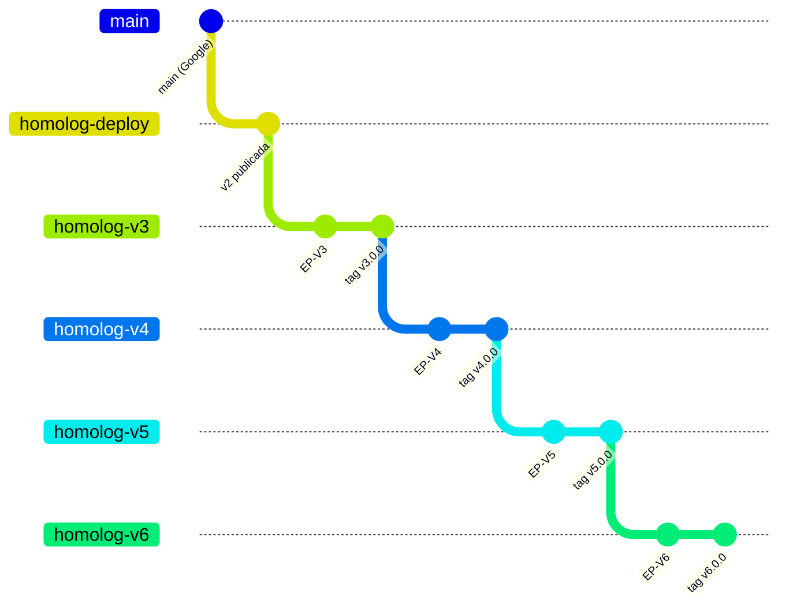

# Backlog das evoluções v3–v6 do ambiente de homologação do AP2

Repositório: `ds-fabiopinheiro/ap2-protocol` · Levantamento: 26/09/2026 · Status: **preview, nada foi criado no GitHub**.

Este pacote contém quatro épicos, um por versão. Cada versão tem um branch próprio (`homolog-v3` … `homolog-v6`), criado a partir da versão anterior. Com isso cada versão acumula as anteriores, e as anteriores continuam publicadas para comparação.

> **Nomes de versão.** "Shopping Agent v1" e "Shopping Agent v2" são nomes dos agentes no repositório do Google. As versões v3–v6 deste backlog são versões do **ambiente de homologação**. A versão atual publicada (`homolog-deploy`) é tratada como **v2**.

## 1. Linha de versões

| Versão | Branch | Criado a partir de | Space (backend) | Frontend (Vercel) | O que passa a existir |
|---|---|---|---|---|---|
| v2 (atual) | `homolog-deploy` | `main` | `ap2-homolog-backend` | `ap2-homolog-frontend` | Shopping Agent v2, jornada autônoma (human-not-present) |
| v3 | `homolog-v3` | `homolog-deploy` | `ap2-homolog-v3` | — (sem mudança de tela) | Merchant Agent e Merchant Payment Processor Agent via A2A; modelo configurável nos agentes A2A |
| v4 | `homolog-v4` | `homolog-v3` | `ap2-homolog-v4` | — (usa ADK Web) | Shopping Agent v1 e Credentials Provider Agent; compra assistida pelo ADK Web |
| v5 | `homolog-v5` | `homolog-v4` | `ap2-homolog-v5` | `ap2-homolog-v5-frontend` | Jornada assistida (human-present) no web client React, ao lado da autônoma |
| v6 | `homolog-v6` | `homolog-v5` | `ap2-homolog-v6` | usa o da v5 | Agentes em Go como backend alternativo; APK Android de homologação |

Ordem pedida pelo usuário para os épicos: Shopping Agent v1, Merchant Agent, Go e Android, jornada assistida. A ordem acima foi ajustada por dependência técnica: o Shopping Agent v1 chama o Merchant Agent (`remote_agents.py`), e a jornada assistida no web client precisa do Shopping Agent v1 publicado. É uma sugestão; a priorização é decisão do time.

## 2. Estratégia de branches



Regras:

1. **Criação.** Cada `homolog-vN` nasce do último commit de `homolog-v(N-1)` (a v3 nasce de `homolog-deploy`). A versão anterior não recebe código da nova.
2. **Tasks.** Cada task é feita em `task/vN-<nº da issue>-<resumo>` e entra por PR em `homolog-vN`. O PR cita a issue (`Closes #nº`).
3. **Fechamento.** A versão fecha com a tag `vN.0.0` no último commit do branch. Correções depois disso usam `vN.0.1`, `vN.0.2`...
4. **Correções nas anteriores.** Se uma correção valer para versões anteriores, ela é feita na mais antiga afetada e levada adiante por PR (`homolog-v3` → `homolog-v4` → …).
5. **Atualizações do Google.** Ficam num branch separado, como o usuário definiu. A incorporação em uma versão é uma task própria da versão.
6. **`main`.** Não é alterado.

## 3. Ambiente de cada versão

| Recurso | Como fica por versão | Motivo |
|---|---|---|
| HF Space | Um Space por versão (`ap2-homolog-vN`), com o mesmo Dockerfile e `AP2_REF=homolog-vN` | A versão anterior continua acessível; o Dockerfile já aceita `AP2_REF` |
| Rebuild | `hf-space-rebuild.yml` mapeia branch → Space | Hoje o workflow só conhece `homolog-deploy` |
| Vercel | Um projeto por versão com mudança de tela (v5) | URLs de preview exigem login na proteção padrão; um projeto por versão mantém a URL pública |
| Supabase | Mesmo projeto `ap2-homolog-db`; tabelas `ap2_env_*` com coluna `environment` e variável `AP2_ENV` | Evita que dois Spaces sobrescrevam o mesmo `ap2_state_files`; não cria custo de branching do Supabase |
| Migrations | Entram também em `homolog-deploy` por PR separado | A integração do Supabase só aplica migrations desse branch |
| Chave do Gemini | Mesma `GOOGLE_API_KEY` em todos os Spaces | A cota do plano gratuito (15 RPM, 500 RPD) é compartilhada entre as versões |

## 4. Organização no GitHub

| Elemento | Uso |
|---|---|
| Labels de tipo | `tipo:épico`, `tipo:feature`, `tipo:pbi`, `tipo:task` |
| Labels de área (tasks) | `área:back`, `área:front`, `área:infra`, `área:qa`, `área:docs`, `área:mobile`, `área:segurança` |
| Labels de versão | `versão:v3` … `versão:v6` |
| Milestones | Um por versão (ex.: "v3 — Merchant Agent (homolog-v3)") |
| Hierarquia | Sub-issues do GitHub: Épico → Feature → PBI → Task |
| Corpo da issue | Seções padronizadas (Campos, Descrição, Regras, Fora de escopo, Critérios de aceite, Definição de pronto) |
| GitHub Projects (opcional) | Campos Status, Estimativa e Iteração preenchidos no Project; o script não preenche esses campos |

Os tipos de issue nativos do GitHub (Epic, Feature, Task) só existem em organizações. Como o repositório é de conta pessoal, o tipo fica em label.

## 5. Números

__SUMMARY__

Estimativas em story points (PBI) e horas (task) são sugestões para o time validar.

## 6. Árvore

```
__TREE__
```

## 7. Ordem sugerida de execução

1. **EP-V3.** Cria o padrão de versões (branch, Space, isolamento no Supabase, rebuild por branch) usado por todas as outras. Publica o Merchant e o Processor, pré-requisitos do Shopping Agent v1.
2. **EP-V4.** O Shopping Agent v1 depende do Merchant (v3) e do Credentials Provider. O ADK Web permite validar a jornada assistida antes de investir em tela.
3. **EP-V5.** A tela React só vale a pena depois de a jornada funcionar no ADK Web. O spike F-V5.2.1 define o contrato de dados.
4. **EP-V6.** Go e Android dependem do cenário assistido estável. O APK exige resolver primeiro a chave do Gemini embutida.

## 8. Verificação da decomposição

- **Cobertura.** Os quatro pedidos do usuário estão cobertos: Merchant Agent (EP-V3), Shopping Agent v1 (EP-V4), jornada assistida (EP-V4 no ADK Web e EP-V5 no web client), Go e Android (EP-V6).
- **Feature com um único PBI.** As features de ambiente (F-V3.1 … F-V6.1) e a F-V4.2 têm um só PBI. Foram mantidas como feature para deixar o trabalho de ambiente visível em cada versão; podem ser rebaixadas a PBI do épico se o time preferir.
- **Spikes.** F-V4.3.1 e F-V5.2.1 são investigações com prova de conceito; os PBIs seguintes dependem da decisão deles.
- **Fatiamento.** A jornada assistida (F-V5.3) foi fatiada por passo do fluxo (opções → pagamento e assinatura → OTP e recibo); camadas técnicas ficam nas tasks.
- **Independência.** Os PBIs de uma mesma feature têm dependência declarada no campo "Depende de".

## 9. Premissas (precisam de confirmação)

- Os agentes do cenário human-present rodam no mesmo container sem conflito de portas (8001–8003 e 8080–8083).
- O plano gratuito do Hugging Face permite um Space CPU Basic por versão.
- O README do cenário human-present cita IntentMandate/CartMandate (vocabulário da v0.1 do AP2), mas o código atual usa `checkout_mandate`/`payment_mandate`. Os testes devem seguir o comportamento observado.
- Não verificado se os agentes em Go chamam o Gemini.
- O app Android lê `GEMINI_API_KEY` do `local.properties` e grava a chave no `BuildConfig`; as URLs são `http://localhost:8001/8002` fixas (`SettingsScreen.kt`, `ShoppingTools.kt`).
- Os agentes A2A do cenário human-present usam o modelo `gemini-3.1-flash-lite-preview` fixo em `common/function_call_resolver.py`.
- O Shopping Agent v1 e seus 3 sub-agentes usam `common/retrying_llm_agent.py` com `max_retries=5`: até 5 tentativas, repetindo o turno inteiro do agente em qualquer exceção, sem espera.

## 10. Pendências para sincronizar

- **Responsável, sprint/iteração e prioridade** de cada issue: não definidos.
- **Token `HF_TOKEN`** do GitHub: precisa de permissão de escrita em cada novo Space (ação do dono da conta).
- **Secrets de cada Space** (`GOOGLE_API_KEY`, `SUPABASE_SECRET_KEY`): cadastrados pelo dono da conta.
- **Faturamento Google** (caso OR_CCR_53, resposta prevista até 03/10/2026): define se a cota continua a do plano gratuito.
- **Tradução pt-BR** do web client: PR #5 aprovado no teste de aceitação da interface em 27/09/2026, com ajustes pedidos; PRs #6–#8 em andamento. Mesclar antes do EP-V5 para evitar conflito de textos.
- **Regra de nova tentativa do modelo** (503): definida no PR de backend que corrige os erros do teste de 27/09; a v3 (F-V3.3.2) e a v4 (F-V4.3.2) reutilizam essa regra.

## 11. Como criar as issues no GitHub

Pré-requisito: [GitHub CLI](https://cli.github.com/) instalada e autenticada (`gh auth login`) com permissão de escrita em issues.

```bash
cd docs/backlog    # no repositório (PR #9); no zip, a pasta é backlog/
python3 create_issues.py                  # simulação: lista o que seria criado
python3 create_issues.py --apply --only v3  # cria só o épico v3 e seus filhos
python3 create_issues.py --apply          # cria tudo
```

O script:

1. cria as labels e os milestones que faltam;
2. cria as issues na ordem pai → filho, com o corpo de `out/issues/*.md`;
3. vincula cada filho ao pai como sub-issue;
4. grava o mapa chave → número em `out/created.json` (arquivo local, ignorado pelo `.gitignore` da pasta).

Se for executado de novo, reaproveita issues com o mesmo título.

## 12. Cenários de teste (BDD)

Cada PBI tem um arquivo `.feature` em `out/bdd/` e a mesma seção "Cenários de teste (BDD)" no corpo da issue. Todos os critérios de aceite têm pelo menos um cenário (matriz em `out/bdd/README.md`). Os 20 arquivos foram validados com o parser Gherkin oficial (`gherkin-official`).

## 13. Arquivos

| Arquivo | Conteúdo |
|---|---|
| `README.md` | Este documento |
| `out/issues/NNN_<chave>.md` | Corpo de cada issue, com front matter (título, labels, milestone, pai) |
| `out/issues.json` | Índice das issues, usado pelo script |
| `out/table.md` | Tabela consolidada de todos os itens |
| `out/tree.txt` | Árvore da decomposição |
| `out/bdd/<PBI>.feature` | Cenários de teste em Gherkin pt-BR, um arquivo por PBI (101 cenários) |
| `out/bdd/README.md` | Preview dos testes: matriz de cobertura, lacunas e premissas por PBI |
| `data.py`, `bdd.py` | Fonte do backlog e dos cenários |
| `build_all.py` | Regera tudo (issues, cenários e este README) |
| `create_issues.py` | Criação no GitHub via `gh` |
